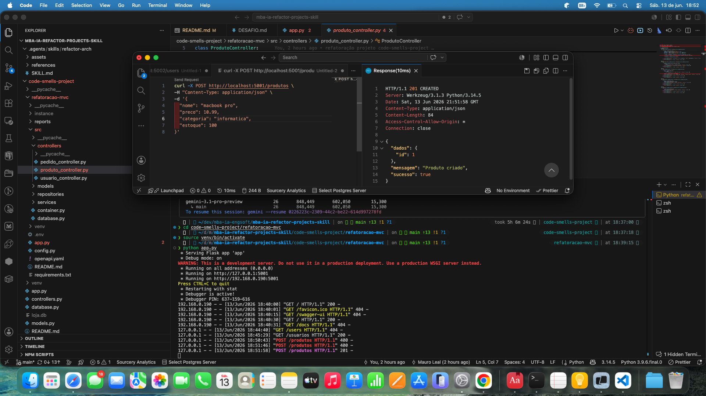
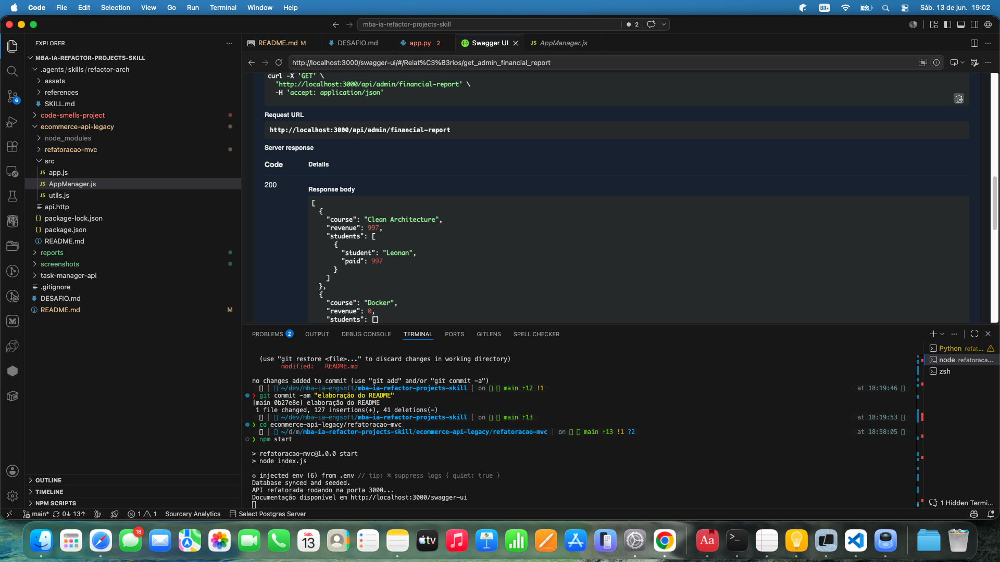
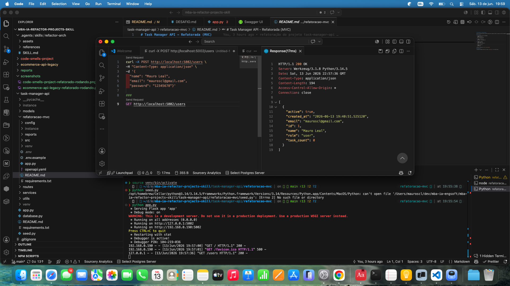

# Agent Skill: Refatoração Arquitetural Automatizada (MVC)

Este repositório contém o desafio de criação de uma **Custom Skill** capaz de analisar, auditar e refatorar projetos de software para o padrão arquitetural **MVC (Model-View-Controller)**. A skill é agnóstica de tecnologia, tendo sido validada em projetos Python (Flask) e Node.js (Express).  
O enunciado do desafio foi movido para o arquivo [DESAFIO.md](DESAFIO.md)

## A) Análise Manual

Antes do desenvolvimento da skill, foi realizada uma auditoria manual nos três projetos legados para identificar padrões de problemas que a automação deveria endereçar.

### 1. code-smells-project (Python/Flask)
*   **CRITICAL**: Exposição de dados sensíveis: a `SECRET_KEY` está hardcoded e é retornada indevidamente no endpoint de health check.
*   **CRITICAL**: Armazenamento inseguro de credenciais: senhas de usuários são persistidas em texto puro, sem qualquer algoritmo de hash.
*   **CRITICAL**: Vulnerabilidade a SQL Injection: consultas ao banco de dados são construídas via concatenação de strings em vez de queries parametrizadas.
*   **HIGH**: Violação extrema do SRP (Single Responsibility Principle): arquivos como `models.py` e `controllers.py` concentram múltiplas entidades e lógicas de negócio.
*   **HIGH**: Acoplamento excessivo: um único controlador centraliza todos os endpoints da aplicação sem separação por domínio.
*   **HIGH**: Lógica de negócio "vazada": as regras de domínio estão implementadas diretamente dentro dos controladores ou modelos de persistência.
*   **MEDIUM**: Falta de autorização granular: rotas administrativas não possuem verificação de permissão específica ou segura.
*   **MEDIUM**: Inexistência de um modelo de dados formalizado: ausência de uso de ORMs modernos (SQLAlchemy incompleto ou ausente).
*   **MEDIUM**: Código redundante: repetição de lógicas de validação e formatação nos métodos de criação e atualização.
*   **LOW**: Problemas de rastreabilidade: uso de `print` para logs em vez de um sistema de logging robusto.
*   **LOW**: Falta de tratamento centralizado de erros e exceções.

### 2. ecommerce-api-legacy (Node.js/Express)
*   **CRITICAL**: Exposição de segredos: chaves de API de pagamento e segredos de gateway estão hardcoded no código.
*   **CRITICAL**: Falha grave de segurança: as senhas são persistidas com algoritmos de hash caseiros e ineficazes (`badCrypto`).
*   **CRITICAL**: Vazamento de dados sensíveis: informações como números de cartão de crédito são registradas em logs abertos.
*   **HIGH**: "God Object": a classe `AppManager.js` concentra responsabilidades de banco de dados, roteamento e lógica de checkout.
*   **HIGH**: Negligência arquitetural: lógicas de persistência e negócio misturadas diretamente nos arquivos de definição de rotas.
*   **HIGH**: Complexidade técnica (Callback Hell): aninhamento excessivo de callbacks dificultando a leitura e tratamento de erros.
*   **HIGH**: Eficiência de Banco de Dados: o endpoint de relatórios financeiros executa múltiplas consultas individuais (problema N+1) em loops.
*   **MEDIUM**: Falta de validação de Schema: payloads de entrada não são validados antes da inserção no banco de dados.
*   **MEDIUM**: Gerenciamento de estado precário: variáveis globais soltas sem encapsulamento em objetos de serviço ou repositório.
*   **MEDIUM**: Inconsistência de deleção: remoção de usuários sem o devido tratamento de dados órfãos em matrículas e pagamentos.
*   **MEDIUM**: Tratamento de erro deficiente: respostas genéricas ("Erro DB") que dificultam o diagnóstico em produção.
*   **LOW**: Nomenclatura não semântica: variáveis com nomes genéricos (ex: `u`, `e`, `p`).

### 3. task-manager-api (Python/Flask)
*   **CRITICAL**: Segurança de credenciais: a senha do usuário é exposta no payload de métodos GET.
*   **CRITICAL**: Armazenamento vulnerável: uso do algoritmo `md5` para armazenamento de senhas e segredos SMTP hardcoded.
*   **HIGH**: APIs Deprecated: dependência direta do método `utcnow()`, marcado como obsoleto no Python moderno.
*   **HIGH**: Performance (Select N+1): listagem de tarefas dispara consultas individuais para cada categoria associada.
*   **HIGH**: Monolito Funcional: toda a lógica de negócio e validação reside na camada de `routes/`.
*   **MEDIUM**: Violação de DRY (Don't Repeat Yourself): a regra de cálculo de tarefas atrasadas (`overdue`) está replicada em 5 arquivos diferentes.
*   **MEDIUM**: Falta de Agregação no Banco: estatísticas de tarefas são geradas via múltiplas queries em vez de queries agregadas (COUNT/GROUP BY).
*   **MEDIUM**: UX de API: falta de mecanismos de paginação e filtros nativos em endpoints de listagem.
*   **LOW**: Responsabilidade Deslocada: codificação de senhas é realizada na lógica de roteamento em vez de no modelo/serviço.

---

## B) Construção da Skill

A skill `refactor-arch` foi projetada para ser um assistente de engenharia de software agnóstico e seguro.

### Decisões de Design
*   **Instalação Global**: A skill reside na pasta `.agents/skills/refactor-arch/`, funcionando como um utilitário global para o workspace. Decidi criar a skill na pasta `.agents` porque é um caminho padrão conhecido por vários dos agentes de mercado. Na prática eu executei ela pelo GEMINI CLI. Não cheguei a testar em outros agentes, mas verifique que estava listada no copilot, então acredito que deveria funcionar lá também.
*   **Parâmetro de Contexto (`path`)**: Implementei suporte ao parâmetro `--path` para que a skill possa ler e refatorar projetos a partir de diretórios específicos sem a necessidade de copiar os arquivos da skill para cada projeto. Para este cenário que é um repositório com múltiplos projetos fica mais fácil. Caso queira executar a skill no diretório corrente basta não passar o parâmetro.
*   **Modo de Proteção (Sandbox)**: Foi criado o parâmetro `mode` com duas opções: `sandbox`, `inplace`. No modo `sandbox` (default) todas as refatorações são geradas em uma subpasta isolada (`refatoracao-mvc`). Isso permite que o desenvolvedor compare os resultados e execute testes sem alterar o código legado original. No modo `inplace` os arquivos originais são alterados.
*   **Catálogo de Anti-patterns**: Utilizei um sistema de referências estruturado em Markdown (`references/catalogo_antipatterns/`) que classifica problemas por severidade e impacto arquitetural. Dividi os anti-patterns em três categorias: segurança, organização de código e padrões. Utilizei o catálogo de anti-patterns tanto na fase para encontrar os "findings" quando na fase 3 para mostrar como corrigir. 
*   **Tecnologia Agnóstica**: Deixei clara a intenção de ser agnóstica no arquivo `SKILL.md`. Optei por deixar os exemplos em linguagens especificas e não em pseudo código. Mas não quis deixar os exemplos apenas nas linguagens que serão aplicadas neste desafio (python, javascript) para não ficar tão direcionado. Utilizei exemplos em python e typescript e também em Java e  C# que não tem projetos neste desafio. Mas deixei claro que se o projeto alvo da refatoração não utilizar a linguagem/framework dos exemplos, deveria se adaptar para a stack de destino, mas nunca trocar a mesma. Podemos ver que temos vários exemplos em `typescript` e o projeto `ecommerce-api-legacy` foi mantido em `javascript`, ou seja, não trocou de linguagem.

*  **Documentação**: inclui uma seção explicita solicitando incluir documentação com open-api e a interface gráfica do `swagger-ui`.

### Desafios Encontrados & Soluções
*   **Domínios Anêmicos**: Durante as primeiras iterações, percebi que a refatoração gerava apenas "classes de dados". Adicionei regras específicas para detectar e corrigir **Modelos Anêmicos**, movendo a lógica de domínio para algumas entidades.
*   **Injeção de Dependências**: Não consegui fazer com que a skill adicionasse um container de injeção de dependência no projeto apenas utilizando o catálogo de anti-patterns. Precisei adicionar uma seção especifica na fase 3.
*   **ORM**: Não consegui fazer com que a skill adicionasse um ORM no projeto apenas utilizando o catálogo de anti-patterns. Precisei adicionar uma seção especifica na fase 3.
*   **Automação de Auditoria**: Integrei ferramentas nativas (como `npm audit`) ao fluxo da skill para que o relatório de auditoria (Fase 2) incluísse problemas de segurança reais vindos das dependências do projeto.

---

## C) Resultados

A skill foi aplicada com sucesso em todos os projetos, mantendo a compatibilidade de API e corrigindo os débitos técnicos mais graves.

Todos os projetos refatorados estão na pasta `refatoracao-mvc` dentro de cada projeto.
- code-smells: [projeto refatorado](code-smells-project/refatoracao-mvc/)
- ecommerce-api: [projeto refatorado](ecommerce-api-legacy/refatoracao-mvc/)
- task-manager-api: [projeto refatorado](task-manager-api/refatoracao-mvc/)

No caminho de cada projeto refatorado temos a pasta reports que contém os arquivos:
- analise-report: relatório da fase 1
- audit-report: relatório da fase 2
- aplicacao-skill: resumo da refatoração (fase 3)

Na raiz do repositório na pasta reports temos o audit report para os três projetos conforme solicitado
- [code-smells-project](reports/audit-code-smells-project.md)
- [ecommerce-api-legacy](reports/audit-ecommerce-api-legacy.md)
- [task-manager-api](reports/audit-task-manager-api.md)

### Resumo de Auditoria

| Projeto | CRITICAL | HIGH | MEDIUM | LOW | Total |
| :--- | :---: | :---: | :---: | :---: | :---: |
| **code-smells-project** | 3 | 3 | 1 | 1 | 8 |
| **ecommerce-api-legacy** | 3 | 2 | 2 | 1 | 8 |
| **task-manager-api** | 2 | 2 | 2 | 1 | 7 |

### Checklist de Validação (Atingido em 3/3 projetos)
- [x] **Fase 1**: Identificação correta de Stack, Framework e Domínio.
- [x] **Fase 2**: Relatório gerado com evidências (Arquivo/Linha) e severidade.
- [x] **Fase 3**: Estrutura MVC implementada (Controllers, Services, Repositories).
- [x] **Segurança**: Segredos removidos do código e movidos para módulos de `config`.
- [x] **Performance**: Consultas N+1 substituídas por Eager Loading/Joins.
- [x] **Saúde**: Aplicação inicia e endpoints originais respondem corretamente.

### Comparação antes/depois da estrutura de cada projeto

**1. code-smells-project (Python/Flask)**
*   **Antes**: Arquitetura monolítica plana. Toda a aplicação era composta de 4 arquivos na raiz (`app.py`, `models.py`, `controllers.py`, `database.py`), misturando roteamento, banco de dados e regras de negócio sem injeção de dependências, além de usar o SQLite (raw SQL) diretamente com concatenação de strings.
*   **Depois**: Padrão MVC implementado de forma granular. O código foi movido para a pasta `src/` e dividido pelos domínios da aplicação (`Produto`, `Usuario`, `Pedido`). Foram criadas camadas especializadas: `models/`, `repositories/`, `services/` e `controllers/`. Introduziu-se o SQLAlchemy como ORM, `dependency-injector` orquestrado em `src/container.py`, e configurações em `config/env.py`. O projeto ganhou também a documentação em `openapi.yaml`.

**2. ecommerce-api-legacy (Node.js/Express)**
*   **Antes**: O projeto continha um "God Object" (`AppManager.js`) que gerenciava o banco de dados, roteamento e lógica de checkout. As definições de rotas agrupavam persistência e regras de negócio. Dependências desatualizadas, segurança frágil com hash amador (`badCrypto`), e credenciais expostas no código.
*   **Depois**: A arquitetura foi estruturada em `src/` contendo `controllers/`, `services/`, `repositories/`, `models/` e `routes/`. O Sequelize foi integrado como ORM (solucionando o N+1 via Eager Loading), e utilizou-se o Awilix para Injeção de Dependências. Foram adicionados middlewares de erro, hash seguro com bcrypt, arquivo `.env` para secrets, e `openapi.yaml` servido via `/swagger-ui`.

**3. task-manager-api (Python/Flask)**
*   **Antes**: Já apresentava uma separação inicial (`models/`, `routes/`, `services/`), mas mantinha lógicas e validações vazadas na camada de roteamento, secrets e credenciais hardcoded, queries gerando Select N+1, duplicação de código na validação de tarefas em atraso, e hash obsoleto em MD5.
*   **Depois**: A camada de persistência foi isolada em `repositories/`. A regra das tarefas em atraso foi consolidada (DRY) no próprio Model de `Task`. As rotas agora funcionam como Controllers limpos repassando execução aos Services. O ORM SQLAlchemy foi refatorado utilizando funções agregadoras para sanar o N+1. Adicionou-se `dependency-injector` em `src/container.py`, configuração `.env` e segurança em hash usando `werkzeug.security`. Também foi incluído o `openapi.yaml`.

### Screenshots
#### `code-smells-project` rodando após a refotoração.

#### `ecommerce-api-legacy` rodando após a refotoração.

#### `task-manager-api` rodando após a refotoração.

### Observações sobre como a skill se comportou em stacks diferentes

A skill `refactor-arch` demonstrou-se verdadeiramente agnóstica e adaptável em diferentes ecossistemas (Python e JavaScript) e estruturas iniciais:
*   **Versatilidade de Ecossistema**: A diretiva de se ajustar à linguagem/framework nativo do projeto foi respeitada de forma consistente. No Node.js/Express (`ecommerce-api-legacy`), a skill recorreu a padrões do ecossistema JS (Sequelize, Awilix, bcrypt, classes e funções de rotas do Express). Em Python/Flask, escolheu o SQLAlchemy, `dependency-injector` e `werkzeug.security`, não forçando padrões alienígenas na stack original.
*   **Aderência Estrutural**: Nos projetos sem separação alguma (`code-smells-project` e `ecommerce-api-legacy`), ela criou a estrutura das camadas (Controllers, Services, Repositories, Models) do zero com clareza. No `task-manager-api`, que já possuía uma divisão rudimentar, ela soube reutilizar o contexto existente e apenas aprimorou a arquitetura ajustando as responsabilidades (ex: extraindo persistência para Repositories e movendo a lógica das Rotas para Services).
*   **Respeito a Contratos (Payloads)**: Mesmo efetuando um "deep refactoring" nas entranhas da regra de negócio e persistência, a skill conseguiu garantir que os Controllers fizessem o de/para dos parâmetros obscuros ou com nomes genéricos. Com isso, evitou quebrar as integrações existentes e os contratos originais da API para o mundo externo.

---

## D) Como Executar

A skill foi testada com **Gemini CLI** utilizando o modelo `gemini-3.1-pro-preview`.

### Comandos de Execução

No terminal, navegue até a raiz do workspace e execute:

```bash
gemini
```

Após abrir o gemini cli, execute dentro dele os comandos a seguir
```bash
# Definir o modelo de alta performance
/model set gemini-3.1-pro-preview

# Executar refatoração no Projeto 1
/refactor-arch —path="code-smells-project"

# Executar refatoração no Projeto 2
/refactor-arch —path="ecommerce-api-legacy"

# Executar refatoração no Projeto 3
/refactor-arch —path="task-manager-api"
```

### Validação das Refatorações
Os resultados de cada execução estão disponíveis nas pastas:
1.  **Relatórios**: `[PROJETO]/refatoracao-mvc/reports/`
2.  **Código**: `[PROJETO]/refatoracao-mvc/src/`

---
**Autor:** Mauro Leal
**Versão da Skill:** 1.0.0
